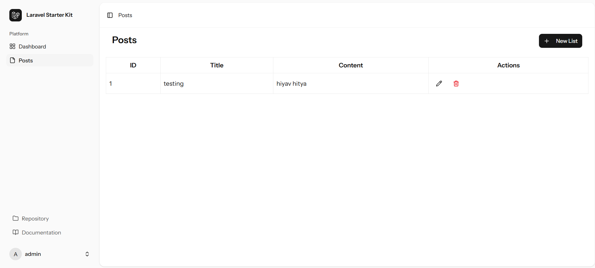

# Laravel-React CRUD

A starter project that integrates **Laravel Starter Kit** to provide a simple **CRUD (Create, Read, Update, Delete)** application.  
This boilerplate is designed for learning full-stack development or as a base for building more advanced applications.

---


## ✨ Features
- Full CRUD functionality (Create, Read, Update, Delete).
- Laravel backend with RESTful API support.
- React frontend powered by Vite.
- Axios integration for API requests.
- TailwindCSS for styling.
- Clean and scalable project structure.

---

## 📦 Requirements
- PHP >= 8.x  
- Composer  
- Node.js & npm  
- MySQL (or another database supported by Laravel)  

---

## ⚡ Installation & Setup

### Backend (Laravel)
Clone repository:
```bash
git clone https://github.com/fajarsid/laravel-react-crud.git
cd laravel-react-crud
```

Install dependencies:
```bash
composer install
```

Copy `.env` file and generate app key:
```bash
cp .env.example .env
php artisan key:generate
```

Configure your database in `.env`, then run migrations:
```bash
php artisan migrate
```

Start Laravel server:
```bash
php artisan serve
```

---

### Frontend (React + Vite)
Navigate to the frontend folder (if separated, e.g., `/frontend`):
```bash
cd frontend
```

Install dependencies:
```bash
npm install
```

Run development server:
```bash
npm run dev
```

Access the frontend at **http://localhost:5173** (or Vite’s default port).

---

## 🔄 Workflow
- Laravel handles backend logic and exposes APIs.  
- React frontend consumes APIs to perform CRUD operations.  
- Axios is used to send/receive data.  
- TailwindCSS ensures responsive UI.  

---

## 📂 Project Structure
```
laravel-react-crud/
│
├── app/               # Laravel backend (controllers, models, etc.)
├── routes/            # API & web routes
├── database/          # Migrations & seeders
├── resources/js/      # React frontend (components, pages, etc.)
├── public/            # Public assets
├── package.json       # Frontend dependencies
├── composer.json      # Backend dependencies
└── ...
```

---

## 🤝 Contribution
1. Fork this repository  
2. Create a new branch:  
   ```bash
   git checkout -b feature-branch
   ```
3. Commit changes:  
   ```bash
   git commit -m "Add new feature"
   ```
4. Push to branch:  
   ```bash
   git push origin feature-branch
   ```
5. Open a Pull Request  

---

## 📄 License
This project is licensed under the **MIT License**.  
See [LICENSE](./LICENSE) for more information.
